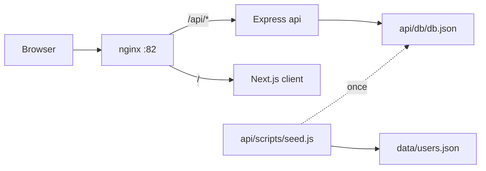
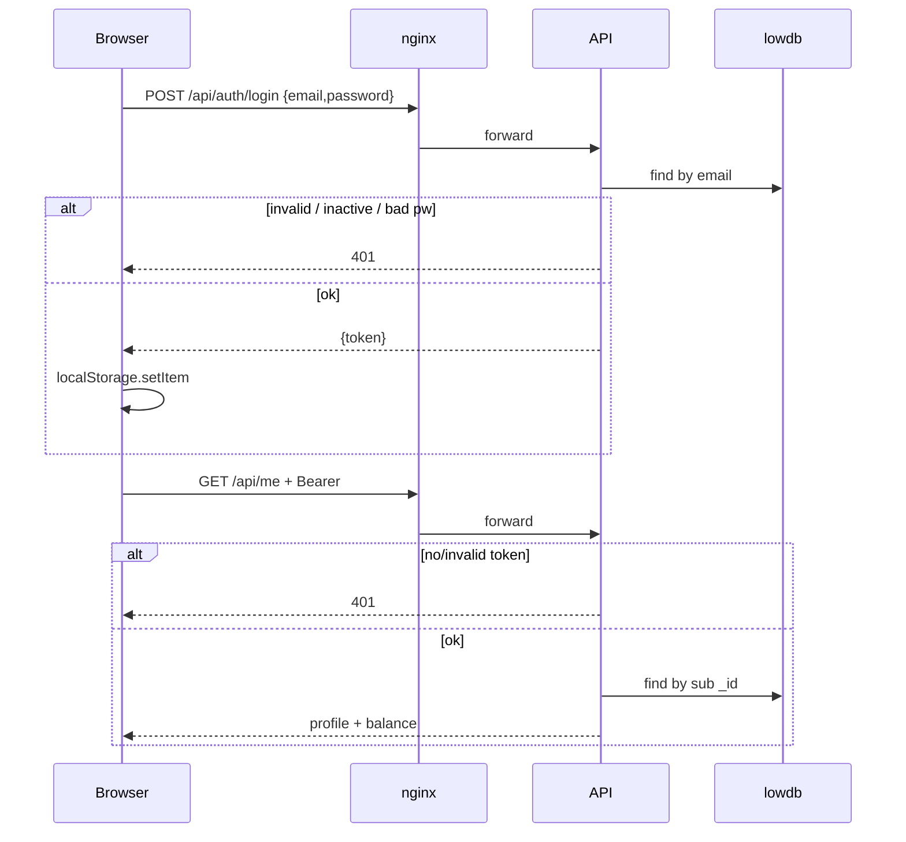
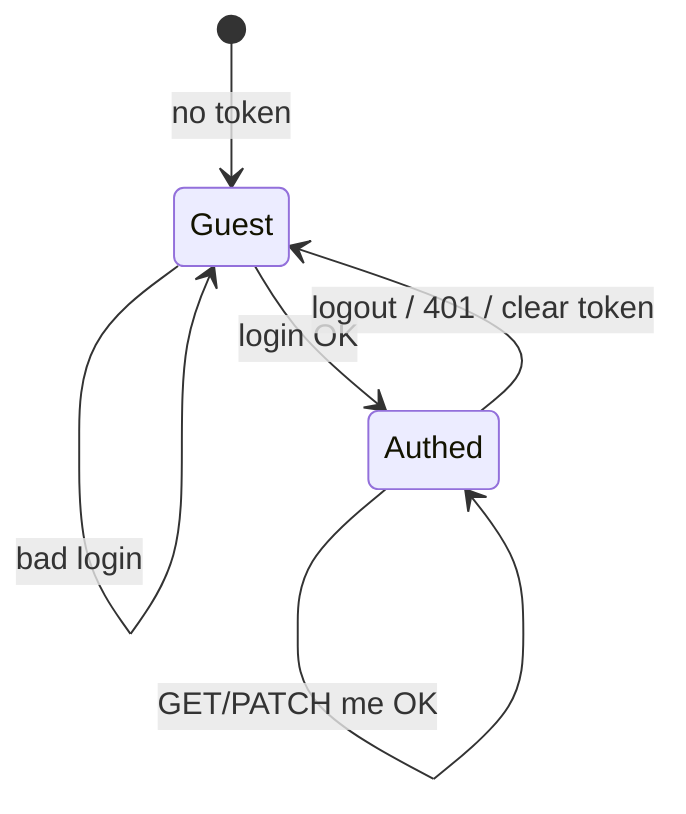
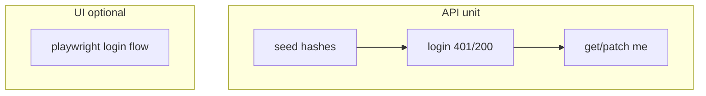

05/29/2026

# System

```mermaid
flowchart LR
  Browser --> Nginx["nginx :82"]
  Nginx -->|"/api/*"| API["Express api"]
  Nginx -->|"/"| Client["Next.js client"]
  API --> Lowdb["api/db/db.json"]
  Seed["api/scripts/seed.js"] -.->|once| Lowdb
  Seed --> SeedFile["data/users.json"]
```

# Dataflow

```mermaid
sequenceDiagram
  participant B as Browser
  participant N as nginx
  participant A as API
  participant D as lowdb

  B->>N: POST /api/auth/login {email,password}
  N->>A: forward
  A->>D: find by email
  alt invalid / inactive / bad pw
    A-->>B: 401
  else ok
    A-->>B: {token}
    B->>B: localStorage.setItem
  end

  B->>N: GET /api/me + Bearer
  N->>A: forward
  alt no/invalid token
    A-->>B: 401
  else ok
    A->>D: find by sub _id
    A-->>B: profile + balance
  end
```

# User (auth state graph)

```mermaid
stateDiagram-v2
  [*] --> Guest: no token
  Guest --> Authed: login OK
  Authed --> Guest: logout / 401 / clear token
  Guest --> Guest: bad login
  Authed --> Authed: GET/PATCH me OK
```

# Tests

```mermaid
flowchart TB
  subgraph unit [API unit]
    login[login 401/200]
    me[get/patch me]
    seed[seed hashes]
  end
  subgraph e2e [UI optional]
    pw[playwright login flow]
  end
  login --> me
  seed --> login

```